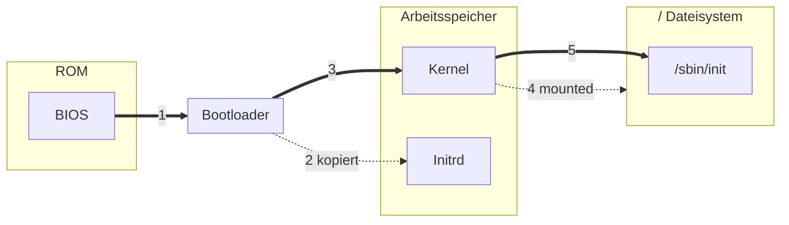

# Bootloader und Bootprozess



## /boot/grub/grub.cfg

```grub.cfg
menuentry "Titel" {
  initrd /boot/kernels/initrd-linux-5.4.70-initrd (2) 
  linux /boot/kernels/linux-5.4.70 (3) root=/dev/sdX (4) init=/sbin/init (5)
}
```
