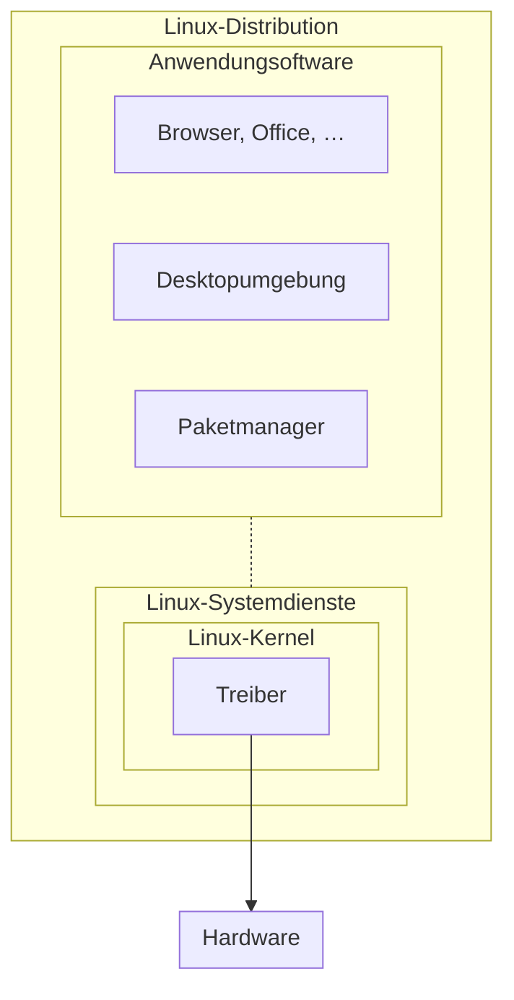

# Architektur

```mermaid
flowchart TB
  subgraph Linux-Distribution
    subgraph Anwendungsoftware
      sonstiges["Browser, Office, …"]
      Desktopumgebung
      Paketmanager
    end
    subgraph System[Linux-Systemdienste]
      subgraph Linux-Kernel
        Treiber
      end
    end
  end
  subgraph Hardware
  end
  Anwendungsoftware -.- System
  Treiber --> Hardware
```
