# Linux, Unix & FOSS

## Unix

* Betriebssystemfamilie seit 1969
* Vereinheitlichter Standart: [POSIX](https://de.wikipedia.org/wiki/Portable_Operating_System_Interface)

```mermaid
flowchart TB
  Unix
  Unix --> Linux
  Unix --> BSD
  Unix --> MacOS["Mac OS"]
  Unix --> Solaris
  Unix --> Minix
  Unix --> andere["…"]
```

## GNU/Linux

* 1989 [GPL](https://de.wikipedia.org/wiki/GNU_General_Public_License)
* 1991 Linux
* 1992 Linux unter GPL lizensiert
* 1993 Debian GNU/Linux

<!---->

## [FOSS](https://de.wikipedia.org/wiki/Free/Libre_Open_Source_Software)

 

 

 

 

 

 

 

 

