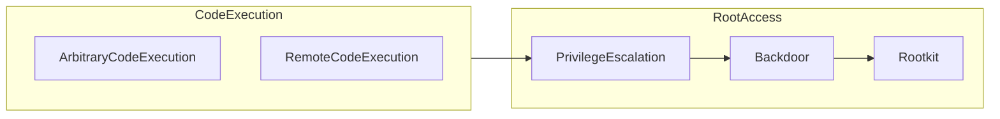

# Hacking

## Was ist Hacken?

## Arten von Vulnerabilities / Exploits

```mermaid
flowchart LR
  subgraph CodeExecution
    ArbitraryCodeExecution
    RemoteCodeExecution
  end
  subgraph RootAccess
    PrivilegeEscalation --> Backdoor --> Rootkit
  end
  CodeExecution --> PrivilegeEscalation
```

## Hackertools

## Das ist Hacken!
