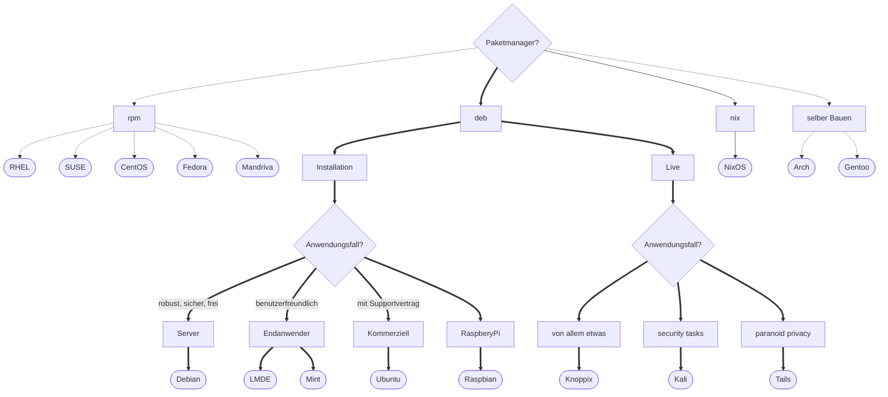
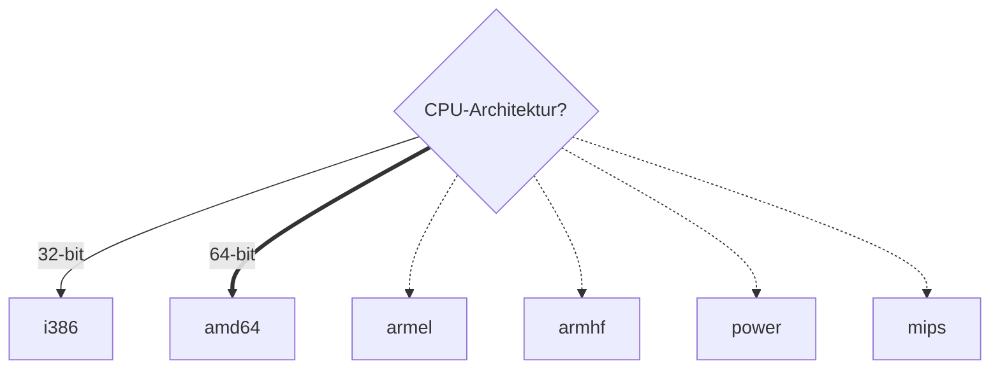

# Entscheidungen für einen Installer

## Distribution

```mermaid
flowchart TD
    Paketmanager{Paketmanager?}
    Paketmanager -.-> rpm
    rpm -.-> RHEL([RHEL])
    rpm -.-> SUSE([SUSE])
    rpm -.-> CentOS([CentOS])
    rpm -.-> Fedora([Fedora])
    rpm -.-> Mandriva([Mandriva])
    Paketmanager ==> deb
    deb ==> Installation
    Installation ==> Anwendungsfall{Anwendungsfall?}
    Anwendungsfall == robust, sicher, frei ==> Server
    Server ==> Debian([Debian])
    Anwendungsfall == benutzerfreundlich ==> Endanwender
    Endanwender ==> LMDE([LMDE])
    Endanwender ==> Mint([Mint])
    Anwendungsfall == mit Supportvertrag ==> Kommerziell
    Kommerziell ==> Ubuntu([Ubuntu])
    Anwendungsfall ==> RaspberyPi
    RaspberyPi ==> Raspbian([Raspbian])
    deb ==> Live ==> AnwendungsfallLive{Anwendungsfall?}
    AnwendungsfallLive ==> alles[von allem etwas]
    alles ==> Knoppix([Knoppix])
    AnwendungsfallLive ==> Security[security tasks]
    Security ==> Kali([Kali])
    AnwendungsfallLive ==> Privacy[paranoid privacy]
    Privacy ==> Tails([Tails])
    Paketmanager --> nix
    nix --> NixOS([NixOS])
    Paketmanager -.-> selber[selber Bauen]
    selber -.-> Arch([Arch])
    selber -.-> Gentoo([Gentoo])
```

## Architektur

```mermaid
flowchart TD
    CPU{CPU-Architektur?}
    CPU -- 32-bit --> i386
    CPU == 64-bit ==> amd64
    CPU -.-> armel
    CPU -.-> armhf
    CPU -.-> power
    CPU -.-> mips
```
