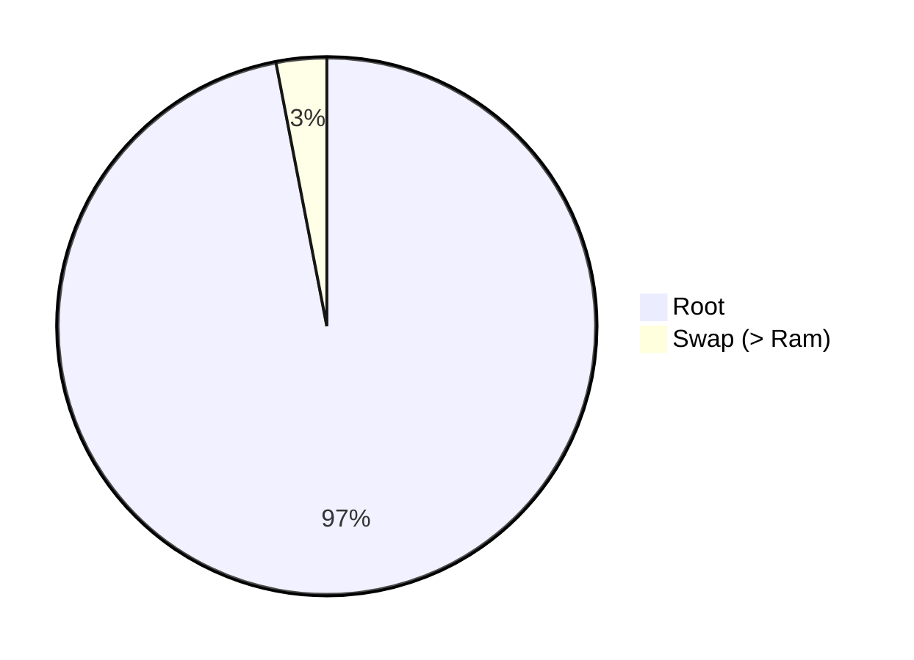
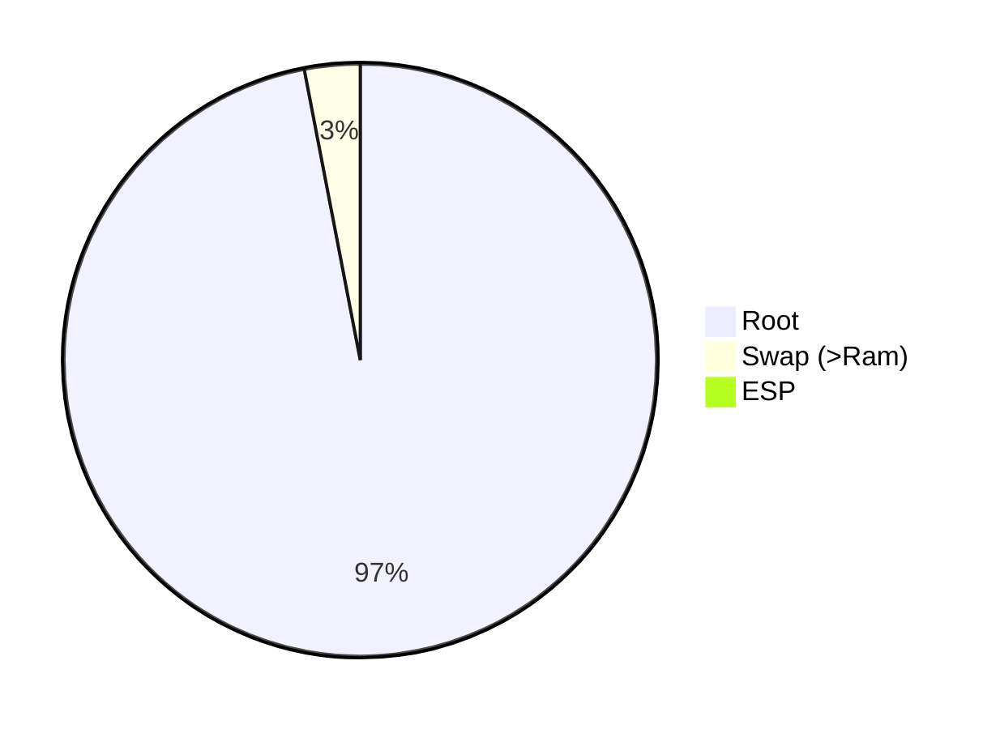
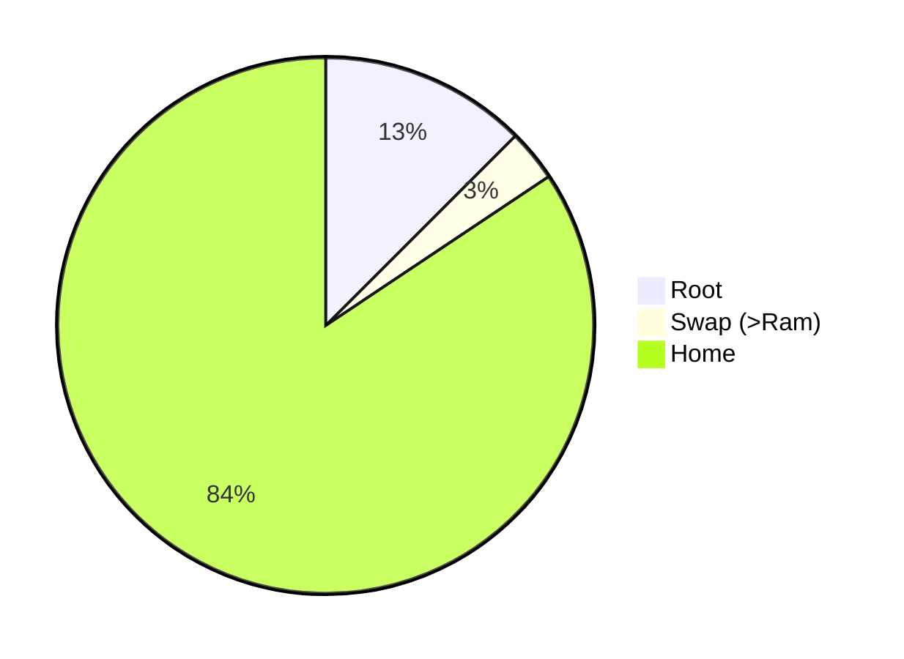

# [Partitionierung](https://nixos.org/manual/nixos/stable/#sec-installation-partitioning)

## Trivial (Root + Swap)

## Mit EFI Systempartition

## Separate /home Partition

## Fortgeschritten

* Raid
* Verschlüsselung
