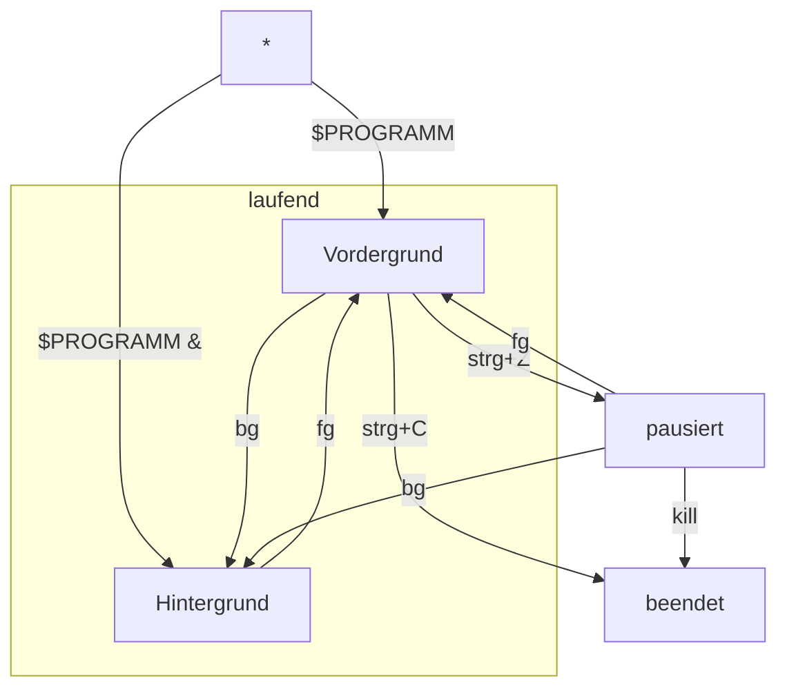

# Prozessverwaltung

[**`ps`**](https://manpages.debian.org/bullseye/procps/ps.1.de.html), **`pstree`**

`bg`, `fg`

[**`kill`**](https://manpages.debian.org/bullseye/procps/kill.1.en.html), `pkill`, `xkill`

**`htop`**, `atop`

---

```bash
$PROGRAMM
# strg+C

$PROGRAMM
# strg+Z

bg

fg

xkill

$PROGRAMM &

ps
ps aux
kill $PID
kill -9 $PID

htop
# q oder F10
```



```bash
echo $$
echo $PPID

pstree
pstree -p  ## --show-pids

pstree $USER
pstree $$ -s  ## --show-parents
```

#### Aufgaben
- [ ] Wie viele Prozesse laufen aktuell?
  - [ ] Beobachte, wie es sich verändert, wenn Programme geöffnet und geschlossen werden.
- [ ] Welche Parentprozesse hat eine geöffnete Shell?
- [ ] Beende die grafische Oberfläche von der Kommandozeile
#### Zusatzaufgabe
- [ ] Von welchen Nutzern werden derzeit Prozesse ausgeführt?
  - [ ] Wie viele Prozesse laufen für die jeweiligen Nutzer?
