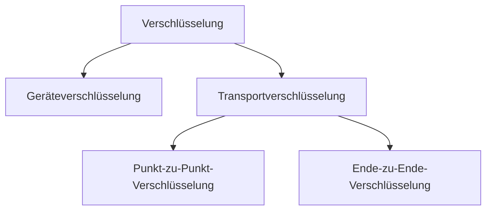
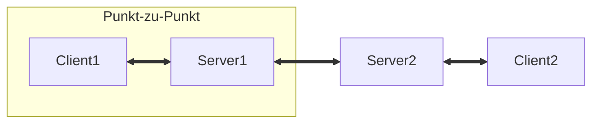
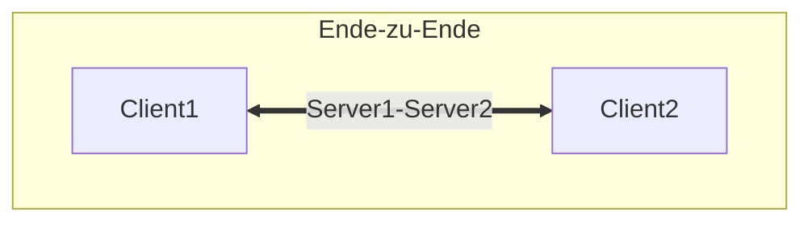

# Verschlüsselung

## Geräteverschlüsselung

### Linux

* [Luks / Cryptsetup](https://manpages.debian.org/bullseye/cryptsetup-bin/cryptsetup.8.en.html)

### Windows

* [BitLocker](https://support.microsoft.com/de-de/windows/aktivieren-der-ger%C3%A4teverschl%C3%BCsselung-0c453637-bc88-5f74-5105-741561aae838)
* [VeraCrypt](https://www.veracrypt.fr/)

## Transportverschlüsselung

#### [SSH](https://linuxize.com/post/how-to-setup-ssh-tunneling/)

#### VPN (z.B. [OpenVPN](https://openvpn.net/)

### Punkt-zu-Punkt-Verschlüsselung

#### [SSL / TLS](https://de.wikipedia.org/wiki/Transport_Layer_Security)

### Ende-zu-Ende-Verschlüsselung

#### [PGP / GPG](https://gnupg.org/)

#### [S/MIME / X.509](https://de.wikipedia.org/wiki/S/MIME)
